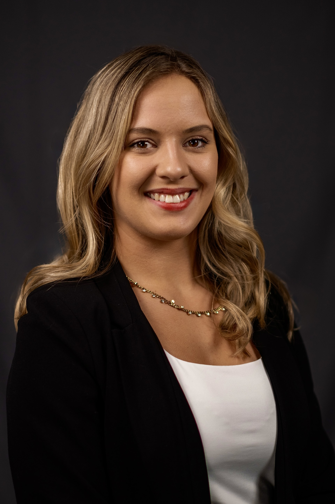
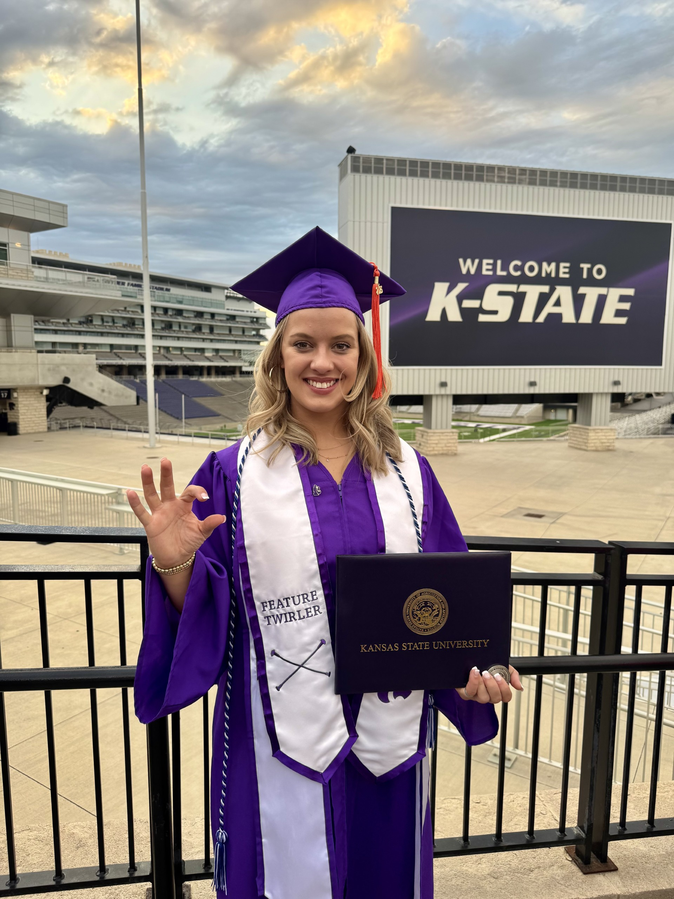

## Bailey Walke — Engineering Portfolio

**M.S. Mechanical Engineering (in progress)**  
**B.S. Mechanical Engineering | Aerospace Emphasis**  
Kansas State University  

---

## About Me
I am a mechanical engineer with a strong focus on aerospace systems, embedded hardware, and high-temperature materials. My work spans space systems engineering, experimental materials research, and hands-on prototyping, with an emphasis on translating theory into validated, real-world designs.

This repository contains a curated selection of academic, research, and design projects demonstrating my technical depth, leadership, and systems-level thinking.

---

## Featured Projects (Headliners)

###  CubeSat Systems Engineering (NuKAT & PHAT-Sat)
**Chief Systems Engineer / Systems Lead**

Led systems engineering efforts for two student-developed CubeSat missions, guiding projects from early concept through formal NASA-style design reviews.

- Mission architecture, CONOPS, and operational modes
- Requirements development and verification (RVMs)
- Interface definition, system block diagrams, and risk management
- Multidisciplinary leadership across mechanical, electrical, software, and payload teams

 **[View CubeSat Projects](./CubeSat)**

---

###  Senior Design — Parkinson’s Tremor Damping Device
**Electronics & Embedded Systems Lead**

Designed and implemented the electronics and embedded control system for a wearable viscous damping device that reduces Parkinsonian tremors without restricting voluntary motion.

- ESP32-based firmware for real-time IMU sensing
- Frequency- and amplitude-based tremor classification
- Human-centered servo actuation with automatic disengagement
- Integration of sensing, actuation, and safety constraints

 **[View Senior Design Project](./Senior-Design)**

---

###  Ceramic Matrix Composites (CMC) Research
**Experimental Materials Research**

Conducted experimental research on multi-cycle polymer-derived ceramic matrix composites for high-temperature aerospace applications.

- Fabrication via polymer infiltration and pyrolysis (PIP)
- SEM and FTIR characterization
- Oxidation testing and materials performance analysis
- Presented at:
  - **2024 Kansas State Undergraduate Research Symposium**
  - **2025 Research of the State – Kansas Graduate Research Summit**

 **[View CMC Research](./Ceramic-Matrix-Composites)**

---

## Additional Engineering Projects

###  Aerodynamics — Glider Design & Flight Testing
Analytical design, manufacturing, and flight testing of a fixed-wing glider, including stability analysis and post-test validation.

 [Aerodynamics](./Aerodynamics)

---

###  Fluid Mechanics — Internal Flow Analysis
Analytical and CFD analysis of pipe flow regimes using Reynolds number theory and SolidWorks Flow Simulation.

 [Fluid Mechanics](./Fluid-Mechanics)

---

###  Heat Transfer — Thermal System Modeling
FEA and analytical evaluation of heat sink material selection and thermal performance.

 [Heat Transfer](./Heat-Transfer)

---

###  Machine Design — Stress Concentration Validation
Finite element validation of theoretical stress concentration factors with mesh convergence studies.

 [Machine Design](./Machine-Design)

---

###  Computer-Automated Manufacturing
Integrated PLC, robotic arm, and CNC laser engraving system demonstrating automated manufacturing workflows.

 [Computer-Automated Manufacturing](./Computer-Automated-Manufacturing)

---

## Skills & Technical Areas
- **Systems Engineering:** CONOPS, requirements, verification, interfaces
- **Aerospace:** CubeSat missions, mission design, ADCS concepts
- **Materials:** CMCs, high-temperature composites, experimental characterization
- **Analysis:** Thermodynamics, heat transfer, fluid mechanics, FEA
- **Manufacturing:** CNC, CAM, PLCs, GD&T, assembly documentation

---

## Contact
- **Email** walke1@ksu.edu
- **Cell** (515)865-0063
- **LinkedIn:** (https://www.linkedin.com/in/bailey-walke/)

---

*This portfolio is actively maintained and reflects my strongest technical and leadership experiences.*
