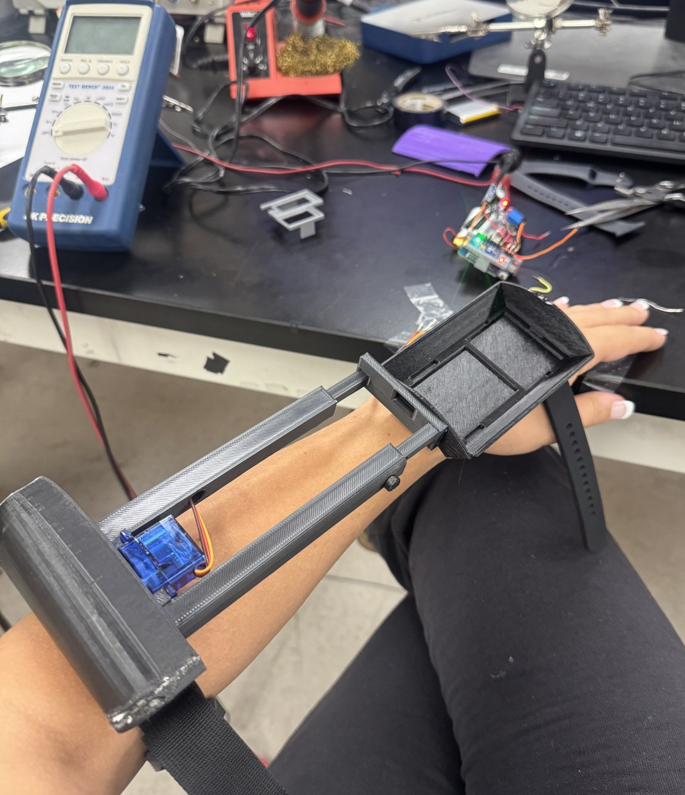

# Viscous Damping Device for Parkinson’s Tremors

**Senior Design Project | Kansas State University (Spring 2025)**

**Role:** Mechatronics & Controls Engineer

**Focus:** Tremor detection, motion classification, and actuator response 

---
## Project Overview
A wearable wrist-mounted assistive device designed to reduce involuntary Parkinsonian tremors without restricting intentional motion. The system combines a passive viscous damping mechanism with sensor-driven adaptive control, resulting in a low-cost, low-power, non-invasive solution focused on comfort, safety, and manufacturability.

---
## My Contributions (Individual)
- Designed and implemented real-time tremor detection firmware on an ESP32 module
- Extracted orientation-independent motion features using MPU6050 gyroscope magnitude
- Implemented lightweight frequency estimation (peak-to-peak timing) suitable for embedded systems
- Developed rule-based motion classification to distinguish:
  - Parkinsonian tremors (~5–15 Hz)
  - Voluntary macro-movements (low-frequency / high-amplitude)
- Implemented smooth servo actuation and automatic reset-to-neutral logic for comfort and safety
- Tuned thresholds experimentally to ensure the device *assists* rather than fights the user
---
## System Architecture
**Mechanical**
- Wrist-mounted fluid reservoir with internal baffle
- Magnetically coupled, servo-driven resistance mechanism
- Passive viscous damping as primary tremor suppression method

**Electrical / Control**
- ESP32 microcontroller
- MPU6050 IMU
- Servo-based adjustable resistance
- Rechargeable Li-ion power system
---
## Embedded Control Logic (Summary)
1. **Sense:** Read angular velocity from IMU
2. **Extract:** Compute gyro magnitude and estimate motion frequency
3. **Classify:** Reject voluntary motion, detect tremor band activity
4. **Respond:** Smoothly increase resistance; disengage after stillness
This approach prioritizes user intent, safety, and low computational overhead.
---
## Repository Contents
- `SeniorDesign TremorActuationCode.pdf` — ESP32 firmware (tremor detection + servo control)
- `SeniorDesign_FinalReport.pdf` — Design, safety, sustainability, economic analysis
- `SeniorDesign_DesignPresentation.pdf` — Concept selection, prototype overview
- `SeniorDesign_ManufacturingDocumentation.pdf` — CAD, BOM, tolerances, assembly
---
## Images & Figures

---
## Why This Project Matters
This project demonstrates my ability to integrate mechanical design, embedded systems, controls, and human-centered engineering into a cohesive, manufacturable system with real-world impact.

---
